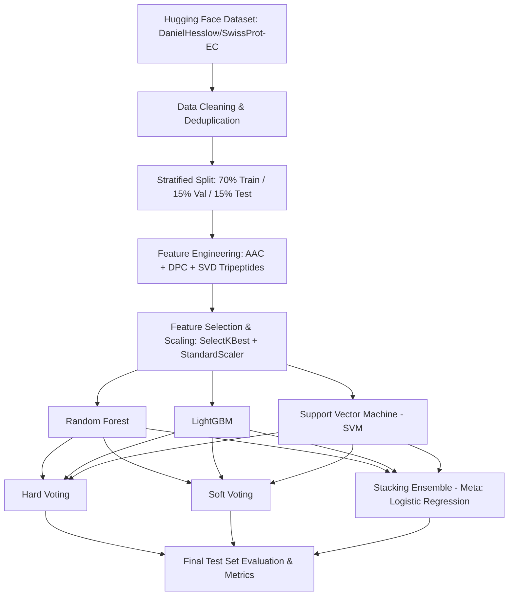

#  Enzyme Function Classification Using Ensemble Learning

A complete machine learning pipeline for predicting the primary Enzyme Commission (EC 1–6) classification of proteins directly from their amino-acid sequences using sequence-derived biochemical features and ensemble modeling.

---

##  Project Overview

Enzymes are biological catalysts essential for metabolic and biochemical processes. The Enzyme Commission (EC) hierarchical numerical classification categorizes enzymes into six primary functional classes based on the chemical reactions they catalyze:

| EC Class | Class Name | Description |
|:---:|:---|:---|
| **EC 1** | **Oxidoreductases** | Catalyze oxidation-reduction reactions (electron transfer) |
| **EC 2** | **Transferases** | Catalyze transfer of functional groups (e.g., methyl, phosphate) |
| **EC 3** | **Hydrolases** | Catalyze cleavage of bonds by addition of water (hydrolysis) |
| **EC 4** | **Lyases** | Catalyze cleavage of bonds by means other than hydrolysis/oxidation |
| **EC 5** | **Isomerases** | Catalyze geometric or structural changes within a single molecule |
| **EC 6** | **Ligases** | Catalyze joining of two molecules coupled with ATP hydrolysis |

The goal of this project is to build an end-to-end, reproducible classifier capable of accurately determining the top-level EC class from raw primary protein sequences.

---

##  Dataset

The project uses the **SwissProt-EC** benchmark dataset loaded directly from Hugging Face:
- **Repository:** [`DanielHesslow/SwissProt-EC`](https://huggingface.co/datasets/DanielHesslow/SwissProt-EC)
- **Data Source:** High-quality, manually reviewed Swiss-Prot protein entries.
- **Loading:** Loaded automatically in Python using the Hugging Face `datasets` library. No manual downloads or local CSV files are required.
- **Splits:** Pre-defined dataset splits (`train`, `dev`, `test`) are combined, cleaned, deduplicated, and re-partitioned into a standardized **70% Train / 15% Validation / 15% Test** stratified split.

---

##  Pipeline Architecture & Notebook Structure

The notebook (`enzyme_classification_colab.ipynb`) is structured into 17 clear, self-contained sections:

### Detailed Breakdown:

1. **Section 1 — Install & Import Libraries**
   - Installs `lightgbm` and `datasets`.
   - Imports core numerical, machine learning, and visualization libraries (`scikit-learn`, `numpy`, `pandas`, `scipy`, `matplotlib`, `seaborn`).
2. **Section 2 — Load Dataset from Hugging Face**
   - Loads `DanielHesslow/SwissProt-EC` (`train`, `dev`, `test` splits) and converts them into pandas DataFrames.
3. **Section 3 — Understand & Explore the Dataset**
   - Inspects schema, column names, sequence length distributions, and non-null counts.
4. **Section 4 — Extract EC Class Label (1–6)**
   - Regex-based extraction of the primary EC class digit from label strings (e.g., `EC:3.4.21.4` → `3`).
5. **Section 5 — Clean Sequences & Handle Duplicates**
   - Removes sequences containing non-standard amino acid codes (anything outside standard 20 letters: `ACDEFGHIKLMNPQRSTVWY`).
   - Deduplicates identical sequences to prevent data leakage across splits.
6. **Section 6 — Analyze Class Distribution**
   - Evaluates class frequencies across EC classes 1–6 and visualizes class imbalance.
7. **Section 7 — Stratified Train / Validation / Test Split**
   - Splits data using stratified sampling into **70% Training**, **15% Validation**, and **15% Test** sets.
8. **Section 8 — Feature Engineering (548 Total Features)**
   - **8A. Amino Acid Composition (AAC - 20 features):** Normalized frequency of each standard amino acid in the sequence.
   - **8B. Dipeptide Composition (DPC - 400 features):** Relative frequency of all $20 \times 20$ adjacent residue pairs.
   - **8C. Tripeptide Embeddings (128 features):** Frequency count of 8,000 possible 3-mers compressed down to 128 dense components using `TruncatedSVD` to avoid memory exhaustion while capturing local sequence motifs.
9. **Section 9 — Feature Selection & Normalization**
   - Identifies high-information features using `SelectKBest` with statistical association tests.
10. **Section 10 — Base Model Training & Hyperparameter Tuning**
    - **10A. Random Forest (RF):** Ensemble of decision trees with balanced class weighting and depth limits.
    - **10B. LightGBM:** Fast gradient-boosted decision tree algorithm tuned across learning rates and tree depths.
    - **10C. Support Vector Machine (SVM):** Non-linear RBF kernel classifier fitted on scaled features with efficient hyperparameter tuning.
11. **Section 11 — Ensemble Methods**
    - **11A. Hard Voting:** Majority rule voting across all three base estimators.
    - **11B. Soft Voting:** Weighted average of class probability estimates.
    - **11C. Stacking:** Out-of-fold prediction probabilities passed as meta-features to a `LogisticRegression` meta-learner.
12. **Section 12 — Final Evaluation on Test Set**
    - Evaluates all individual models and ensemble variants on the untouched test split.
13. **Section 13 — Confusion Matrices**
    - Multi-panel confusion matrix plots displaying both raw misclassification counts and normalized true-class recall rates.
14. **Section 14 — Per-Class Metrics Table**
    - Detailed per-class precision, recall, and F1-score breakdowns highlighting performance on both majority and minority classes.
15. **Section 15 — Multi-class ROC Curves**
    - One-vs-Rest (OvR) receiver operating characteristic curves and Area Under the Curve (AUC) for each EC class.
16. **Section 16 — Feature Importance Analysis**
    - Top predictive features extracted from Random Forest and LightGBM models, linking model decisions back to biochemically meaningful amino acid and dipeptide patterns.
17. **Section 17 — Error Analysis & Conclusion**
    - Analyzes frequent misclassification pairs (e.g., Transferases vs. Hydrolases) and summarizes final model selection and key takeaways.

---

##  Key Design Decisions & Optimizations

- **Direct API Ingestion:** Removing local file dependencies ensures high reproducibility across different platforms without path mismatches.
- **Memory-Safe Dimensionality Reduction:** Full tripeptide counts ($20^3 = 8,000$ dimensions per sequence) cause severe memory bottlenecks. Using `TruncatedSVD` compresses this sparse space into 128 dense components without losing informative sequence context.
- **Handling Class Imbalance:** Certain enzyme classes (such as Hydrolases and Transferases) appear much more frequently than Lyases or Isomerases. `class_weight='balanced'` and stratified splitting ensure minority classes are not penalized or neglected.
- **Feature Scaling:** `StandardScaler` is fitted exclusively on the training partition and applied to validation/test sets to prevent data leakage while maintaining convergence for SVM and logistic meta-learners.
- **Stacking Meta-Learner:** A regularized `LogisticRegression` meta-classifier is chosen to combine predicted probability distributions smoothly without overfitting.

---

## Evaluation Metrics

Because enzyme classes are naturally imbalanced, standard accuracy alone can be misleading:
- **Primary Metric:** **Macro F1-Score** (gives equal weight to each enzyme class, accurately reflecting minority class accuracy).
- **Secondary Metrics:**
  - **Accuracy** (overall correct prediction percentage).
  - **Matthews Correlation Coefficient (MCC)** (balanced metric sensitive to true/false positives and negatives across all classes).
  - **Macro Precision & Macro Recall**.
  - **ROC-AUC (One-vs-Rest)** (discriminative ability per enzyme class).

---

## Generated Visualizations

Running the notebook produces and saves several publication-quality figures:

- `class_distribution.png`: Bar and pie charts detailing the distribution of EC classes 1 through 6.
- `confusion_matrices.png`: Normalized confusion matrices for all base and ensemble models.
- `roc_curves.png`: One-vs-Rest ROC curves with per-class and macro-average AUC scores.
- `feature_importance.png`: Top-ranking biochemical features ranked by tree-based feature importance.
- `model_comparison.png`: Side-by-side performance comparison of base models vs. voting and stacking ensembles.

---

## Dependencies

- Python 3.9+
- `datasets` (Hugging Face)
- `lightgbm`
- `scikit-learn`
- `numpy`
- `pandas`
- `scipy`
- `matplotlib`
- `seaborn`
